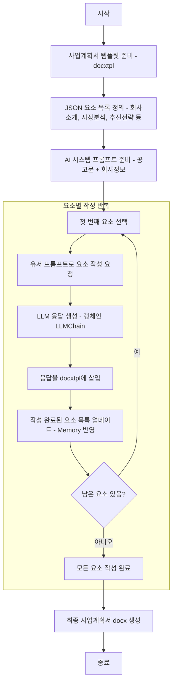

```mermaid
flowchart TD
    A[시작] --> B["사업계획서 템플릿 준비 - docxtpl"]
    B --> C["JSON 요소 목록 정의 - 회사소개, 시장분석, 추진전략 등"]
    C --> D["AI 시스템 프롬프트 준비 - 공고문 + 회사정보"]
    D --> E[첫 번째 요소 선택]

    subgraph 반복처리["요소별 작성 반복"]
        E --> F["유저 프롬프트로 요소 작성 요청"]
        F --> G["LLM 응답 생성 - 랭체인 LLMChain"]
        G --> H["응답을 docxtpl에 삽입"]
        H --> I["작성 완료된 요소 목록 업데이트 - Memory 반영"]
        I --> J{남은 요소 있음?}
        J -- 예 --> E
        J -- 아니오 --> K[모든 요소 작성 완료]
    end

    K --> L["최종 사업계획서 docx 생성"]
    L --> M[종료]
```